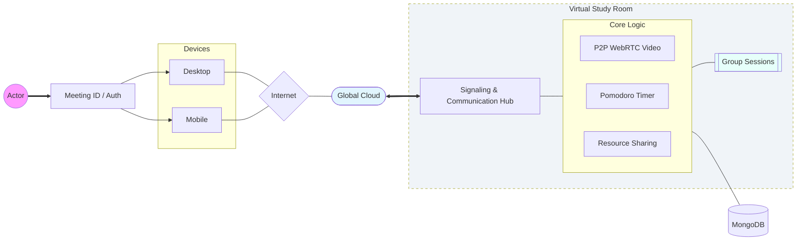

# Project Architecture Diagram

This diagram represents the technical structure of the **Virtual Study Room** project, highlighting the interaction between the React frontend, Node.js backend, and the P2P WebRTC communication layer.

### Component Details
- **Signaling & Communication Hub (Socket.io)**: Manages real-time data handover for video calls and event broadcasting for synchronized study tools.
- **WebRTC P2P Engine**: Enables direct peer-to-peer video/audio streaming for ultra-low latency communication.
- **Resource Sharing**: A centralized system for users to share PDFs, links, and study notes in real-time.
- **Pomodoro Timer**: A synchronized clock that keeps all participants on the same study-break schedule.
- **MongoDB Atlas**: Securely stores user profiles, room metadata, and shared resource links.
